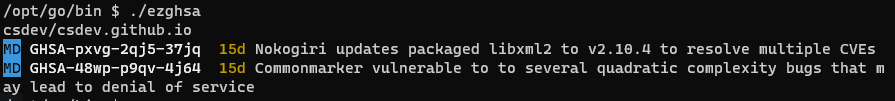

# EZGHSA



## Features

EZGHSA is a command-line tool for summarizing and filtering vulnerability alerts on Github repositories.

* List alerts for a user, organization, or specific set of repositories.
* Display Github Security Advisory (GHSA) IDs.
* Filter alerts by ID, severity, and age.
* Check if alerts are enabled or disabled.
* Run interactively or from CI/CD scripts.

## Setup and Install

### Standalone Binary (Recommended)

Download EZGHSA from the Github [releases page](https://github.com/csdev/ezghsa/releases).
The binary is statically-linked, so no other dependencies are needed.

### Github Authentication

EZGHSA needs to authenticate with the Github API.
Create a fine-grained access token with the following repository permissions:

* **Administration (read-only)** - Required to check if Dependabot alerts are enabled on the repository.
* **Dependabot alerts (read-only)** - Required to retrieve the alert information.
* **Metadata (read-only)** - Required to get general status info about the Github repository.

You can allow the token to access all your repositories, or limit it to specific ones.
EZGHSA will retrieve alerts from all repositories you give it access to, and ignore everything else.

Write your token to the file `~/.config/ezghsa/hosts.yml`, in the following format:

```yml
github.com:
    oauth_token: github_pat_asdf1234asdf1234
```

Alternatively, you can use a personal access token with similar permissions.

EZGHSA also respects the `GITHUB_TOKEN` environment variable. This makes it easy to use on Github Actions
and other CI environments.

### Docker (Advanced)

A Docker container is provided for advanced workflows that cannot use the standalone binaries.

With credentials from the environment:

```bash
docker run -e GITHUB_TOKEN --rm csang/ezghsa:latest
```

With a bind-mounted credential file:

```bash
docker run -v "$HOME/.config/ezghsa/hosts.yml:/home/go/.config/ezghsa/hosts.yml:ro" \
    --rm csang/ezghsa:latest
```

## Examples

```sh
# List alerts for all repos owned by the current user
ezghsa

# List alerts for specific repos
ezghsa --repo=csdev/ezghsa,csdev/csdev.github.io

# Filter alerts by GHSA ID
ezghsa --ghsa=GHSA-pxvg-2qj5-37jq

# Filter alerts by CVE ID
ezghsa --cve=CVE-2023-29469

# Filter alerts by severity (low, medium, high, critical)
ezghsa --severity=medium

# Filter and fail if alerts have been open longer than 30 days
ezghsa --days=30 --fail

# List all repos, fail if alerts are disabled
ezghsa --list-all --fail-disabled
```

## Exit Status

`ezghsa --fail` exits with a non-zero status code if any matching alerts are found.
The status code indicates the highest severity alert that was found.

1. Unknown / generic error
2. Low severity (LO)
3. Medium severity (MD)
4. High severity (HI)
5. Critical severity (CR)

## Color Output

EZGHSA supports the `NO_COLOR` and `FORCE_COLOR` environment variables from
[jwalton/gchalk](https://github.com/jwalton/gchalk#color-detection).
Color output will be written on TTY and CI environments, unless overridden by
one of those variables.

## License

EZGHSA is licensed under the MIT License. See [LICENSE.txt](LICENSE.txt).

The statically-linked distribution uses musl libc
([MIT licensed](https://git.musl-libc.org/cgit/musl/tree/COPYRIGHT)).

For information on Go module dependencies and links to their open-source licenses,
see the [go.mod](go.mod) file or run `ezghsa --version`.
